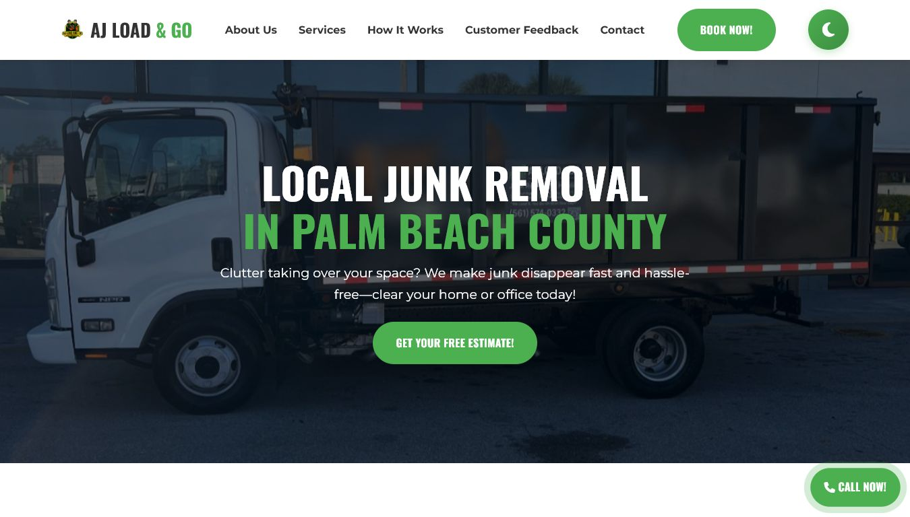
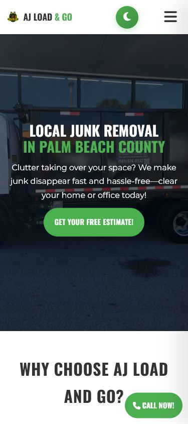

# AJ Load & Go

Responsive static website for **AJ Load & Go**, a local junk-removal service in Palm Beach County, Florida.

The project is designed as a simple conversion-focused client site: visitors can understand the service, review accepted job types, and request an estimate by phone, WhatsApp, or an online form.

## Live site

[www.ajloadandgo.com](https://www.ajloadandgo.com/)

## Screenshots

| Desktop | Mobile |
| --- | --- |
|  |  |

## Stack

- Semantic HTML5
- CSS3 with responsive layouts, custom properties, and light/dark themes
- Vanilla JavaScript
- Formspree for contact-form delivery
- Font Awesome and Google Fonts
- GitHub Pages/custom-domain-ready static assets

## Features

- Responsive navigation with an accessible mobile menu
- Service and three-step booking overview
- Phone, WhatsApp, email, and contact-form conversion paths
- Client-side phone and email validation
- Formspree submission with success and error feedback
- Honeypot field for basic bot protection
- Optional image previews and attachment limits
- Basic SEO metadata, canonical URL, favicon set, and web manifest
- Reduced-motion support, keyboard focus styles, and dark mode
- Short excerpts from verified Google reviews, linked to the public Business Profile

## Run locally

No build step is required.

```bash
git clone <repository-url>
cd ajloadandgo
python -m http.server 8000
```

Then open [http://localhost:8000](http://localhost:8000).

You can also use any static-file server, such as `npx serve .`.

## Tests

The smoke tests use Node.js built-ins and require no installed packages:

```bash
npm test
```

They check the critical conversion paths, form safeguards, SEO essentials, and the absence of the removed placeholder metrics.

## What I learned

- A small service website benefits more from clear conversion paths and trustworthy copy than from unnecessary technical complexity.
- Responsive behavior must be tested at real viewport sizes, especially menus, fixed CTAs, and long forms.
- Contact forms need both browser-side feedback and server-side delivery handling; validation alone is not enough.
- Social proof should remain traceable to a public source. Removing unverifiable names and statistics makes the project stronger in a portfolio and safer for a real client.

## Project scope

This is intentionally a lightweight static site. It demonstrates a fast commercial delivery for a local business rather than a complex application architecture.
